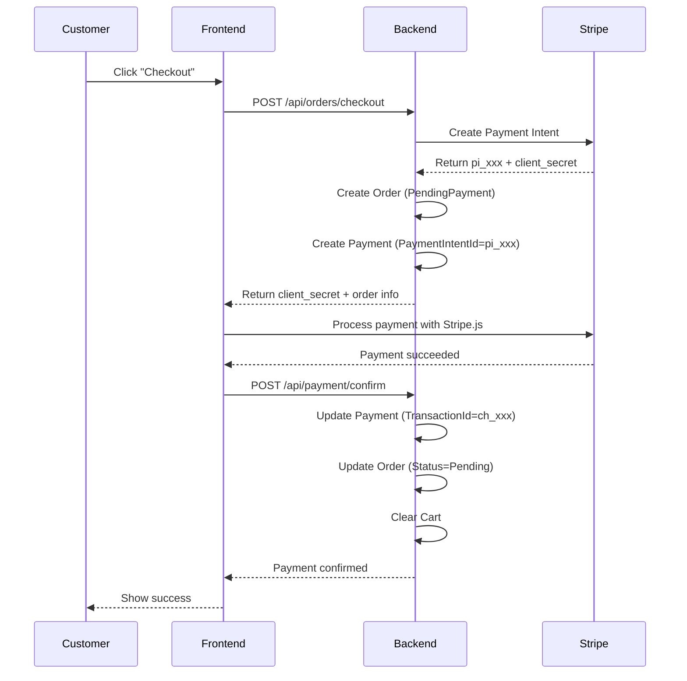
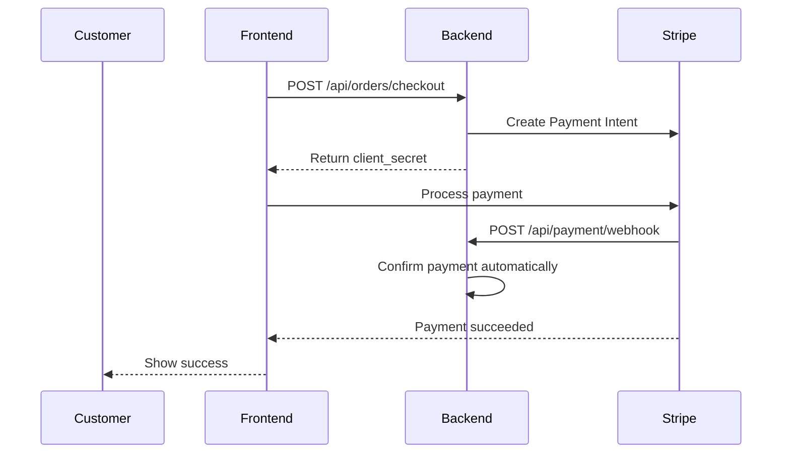

# Payment API Documentation

## Overview
Complete API reference for payment operations in the AI Marketplace.

---

## Endpoints

### 1. Create Payment Intent (Deprecated)
**?? DEPRECATED**: Use `POST /api/orders/checkout` instead

```http
POST /api/payment/create-intent
Authorization: Bearer {token}
Roles: Customer, Admin
```

**Request Body:**
```json
{
    "amount": 5000,          // Amount in cents (e.g., $50.00)
    "currencyCode": "USD"    // 3-letter currency code
}
```

**Response:**
```json
{
    "isSuccess": true,
    "data": "pi_1234567890_secret_abc123",  // Client secret for Stripe.js
    "message": "Payment intent created successfully. Use this client secret with Stripe.js",
    "errors": []
}
```

**Note:** This endpoint is deprecated because it doesn't create an order. Use the checkout flow instead.

---

### 2. Confirm Payment
Confirms a payment after Stripe processes it successfully.

```http
POST /api/payment/confirm
Authorization: Bearer {token}
Roles: Customer, Admin
```

**Request Body:**
```json
{
    "paymentIntentId": "pi_1234567890",  // Required: Stripe Payment Intent ID
    "chargeId": "ch_9876543210"          // Optional: Stripe Charge ID
}
```

**Response:**
```json
{
    "isSuccess": true,
    "data": {
        "id": 1,
        "orderId": 123,
        "paymentMethod": "Stripe",
        "paymentIntentId": "pi_1234567890",
        "transactionId": "ch_9876543210",
        "amount": 5000,
        "currency": "usd",
        "status": "Succeeded",
        "createdAt": "2024-01-15T10:30:00Z",
        "processedAt": "2024-01-15T10:30:10Z",
        "completedAt": "2024-01-15T10:30:10Z"
    },
    "message": "Payment confirmed successfully",
    "errors": []
}
```

**Features:**
- ? Idempotent - calling multiple times with same PaymentIntentId is safe
- ? Updates order status from `PendingPayment` to `Pending`
- ? Records transaction ID (Charge ID)

---

### 3. Get Payment by ID
Retrieves payment details by payment ID.

```http
GET /api/payment/{id}
Authorization: Bearer {token}
Roles: Customer, Seller, Admin
```

**Response:**
```json
{
    "isSuccess": true,
    "data": {
        "id": 1,
        "orderId": 123,
        "paymentMethod": "Stripe",
        "paymentIntentId": "pi_1234567890",
        "transactionId": "ch_9876543210",
        "amount": 5000,
        "currency": "usd",
        "status": "Succeeded",
        "failureReason": null,
        "refundedAmount": null,
        "refundTransactionId": null,
        "refundedAt": null,
        "refundReason": null,
        "createdAt": "2024-01-15T10:30:00Z",
        "processedAt": "2024-01-15T10:30:10Z",
        "completedAt": "2024-01-15T10:30:10Z"
    },
    "message": "Payment retrieved successfully",
    "errors": []
}
```

**Authorization:**
- Buyers can only view their own payments
- Vendors can view payments for their orders
- Admins can view all payments

---

### 4. Get Payments by Order ID
Retrieves all payment attempts for a specific order.

```http
GET /api/payment/order/{orderId}
Authorization: Bearer {token}
Roles: Customer, Seller, Admin
```

**Response:**
```json
{
    "isSuccess": true,
    "data": [
        {
            "id": 1,
            "orderId": 123,
            "paymentMethod": "Stripe",
            "paymentIntentId": "pi_1234567890",
            "transactionId": "ch_9876543210",
            "amount": 5000,
            "currency": "usd",
            "status": "Succeeded",
            "createdAt": "2024-01-15T10:30:00Z",
            "processedAt": "2024-01-15T10:30:10Z",
            "completedAt": "2024-01-15T10:30:10Z"
        },
        {
            "id": 2,
            "orderId": 123,
            "paymentMethod": "Stripe",
            "paymentIntentId": "pi_0987654321",
            "transactionId": null,
            "amount": 5000,
            "currency": "usd",
            "status": "Failed",
            "failureReason": "Card declined",
            "createdAt": "2024-01-15T10:25:00Z",
            "processedAt": "2024-01-15T10:25:05Z",
            "completedAt": null
        }
    ],
    "message": "Payments retrieved successfully",
    "errors": []
}
```

**Use Case:** Track multiple payment attempts, see payment history

---

### 5. Process Refund
Processes a full or partial refund for a payment.

```http
POST /api/payment/refund
Authorization: Bearer {token}
Roles: Admin
```

**Request Body:**
```json
{
    "paymentId": 1,
    "refundAmount": 5000,                    // Amount in cents
    "refundReason": "Customer requested refund"
}
```

**Response:**
```json
{
    "isSuccess": true,
    "data": {
        "id": 1,
        "orderId": 123,
        "paymentMethod": "Stripe",
        "paymentIntentId": "pi_1234567890",
        "transactionId": "ch_9876543210",
        "amount": 5000,
        "currency": "usd",
        "status": "Refunded",                // Status changed
        "refundedAmount": 5000,              // Refund amount
        "refundTransactionId": null,
        "refundedAt": "2024-01-15T11:00:00Z",
        "refundReason": "Customer requested refund",
        "createdAt": "2024-01-15T10:30:00Z",
        "processedAt": "2024-01-15T10:30:10Z",
        "completedAt": "2024-01-15T10:30:10Z"
    },
    "message": "Refund processed successfully",
    "errors": []
}
```

**Features:**
- ? Full refunds: Status becomes `Refunded`
- ? Partial refunds: Status becomes `PartiallyRefunded`
- ? Multiple partial refunds supported
- ?? Admin only

---

### 6. Stripe Webhook
Receives webhook events from Stripe.

```http
POST /api/payment/webhook
Authorization: None (validated by Stripe signature)
```

**Headers:**
```
Stripe-Signature: t=1234567890,v1=abc123...
```

**Webhook Events to Handle:**
- `payment_intent.succeeded` - Automatically confirm payment
- `payment_intent.payment_failed` - Mark payment as failed
- `charge.refunded` - Update refund information

**Response:**
```json
200 OK
```

**?? TODO:** This endpoint requires implementation
- Verify Stripe signature
- Handle different event types
- Call appropriate commands

---

## Complete Payment Flow

### Recommended Flow (Using Checkout)



### Alternative Flow (Webhook-based)



---

## Error Handling

### Common Error Responses

**400 Bad Request:**
```json
{
    "isSuccess": false,
    "data": null,
    "message": "Invalid payment data",
    "errors": ["Amount must be greater than 0"]
}
```

**401 Unauthorized:**
```json
{
    "isSuccess": false,
    "data": null,
    "message": "User not authenticated",
    "errors": ["Unauthorized"]
}
```

**404 Not Found:**
```json
{
    "isSuccess": false,
    "data": null,
    "message": "The requested payment does not exist",
    "errors": ["Payment not found"]
}
```

**403 Forbidden:**
```json
{
    "isSuccess": false,
    "data": null,
    "message": "Access denied",
    "errors": ["You don't have access to this payment"]
}
```

---

## Payment Status Flow

```
Pending ? Processing ? Succeeded
   ?                       ?
Failed              PartiallyRefunded ? Refunded
   ?                       ?
Cancelled                Cancelled
```

---

## Field Descriptions

### Payment Fields

| Field | Type | Description |
|-------|------|-------------|
| `id` | int | Unique payment ID |
| `orderId` | int | Associated order ID |
| `paymentMethod` | string | Payment method (Stripe, PayPal, CashOnDelivery, etc.) |
| `paymentIntentId` | string | Stripe Payment Intent ID (pi_xxxxx) - Set when payment is created |
| `transactionId` | string | Stripe Charge ID (ch_xxxxx) - Set when payment succeeds |
| `amount` | long | Payment amount in smallest currency unit (cents) |
| `currency` | string | 3-letter currency code (usd, eur, etc.) |
| `status` | string | Payment status (Pending, Succeeded, Failed, etc.) |
| `failureReason` | string | Reason for payment failure (if failed) |
| `refundedAmount` | long | Total amount refunded (in cents) |
| `refundTransactionId` | string | Stripe Refund ID (re_xxxxx) |
| `refundedAt` | datetime | When refund was processed |
| `refundReason` | string | Reason for refund |
| `createdAt` | datetime | When payment was created |
| `processedAt` | datetime | When payment processing started |
| `completedAt` | datetime | When payment was completed |

---

## Examples

### Example 1: Complete Checkout with Stripe

**Step 1: Initiate Checkout**
```javascript
// Frontend
const response = await fetch('/api/orders/checkout', {
    method: 'POST',
    headers: {
        'Authorization': `Bearer ${token}`,
        'Content-Type': 'application/json'
    },
    body: JSON.stringify({
        shippingAddress: '123 Main St',
        paymentMethod: 'Stripe'
    })
});

const data = await response.json();
const { paymentClientSecret, pendingOrders } = data.data;
```

**Step 2: Process Payment with Stripe.js**
```javascript
// Frontend
const stripe = Stripe('pk_test_...');
const { error, paymentIntent } = await stripe.confirmCardPayment(
    paymentClientSecret,
    {
        payment_method: {
            card: cardElement,
            billing_details: { name: 'Customer Name' }
        }
    }
);

if (error) {
    // Handle error
} else if (paymentIntent.status === 'succeeded') {
    // Confirm payment on backend
    await confirmPayment(paymentIntent.id, paymentIntent.charges.data[0].id);
}
```

**Step 3: Confirm Payment**
```javascript
// Frontend
await fetch('/api/payment/confirm', {
    method: 'POST',
    headers: {
        'Authorization': `Bearer ${token}`,
        'Content-Type': 'application/json'
    },
    body: JSON.stringify({
        paymentIntentId: paymentIntent.id,
        chargeId: paymentIntent.charges.data[0].id
    })
});
```

---

### Example 2: Process Refund

```javascript
// Admin only
await fetch('/api/payment/refund', {
    method: 'POST',
    headers: {
        'Authorization': `Bearer ${adminToken}`,
        'Content-Type': 'application/json'
    },
    body: JSON.stringify({
        paymentId: 1,
        refundAmount: 2500,  // Partial refund of $25.00
        refundReason: 'Partial order cancellation'
    })
});
```

---

### Example 3: Get Payment History

```javascript
// Get all payments for an order
const response = await fetch('/api/payment/order/123', {
    headers: {
        'Authorization': `Bearer ${token}`
    }
});

const data = await response.json();
const payments = data.data;

// Filter to see only successful payments
const successfulPayments = payments.filter(p => p.status === 'Succeeded');

// Calculate total refunded
const totalRefunded = payments.reduce((sum, p) => sum + (p.refundedAmount || 0), 0);
```

---

## Best Practices

1. **Always use HTTPS** - Never send payment data over HTTP
2. **Validate on both client and server** - Don't trust client-side validation
3. **Handle errors gracefully** - Show user-friendly error messages
4. **Implement idempotency** - Use PaymentIntentId to prevent duplicate charges
5. **Set up webhooks** - Don't rely solely on client-side confirmation
6. **Log all payment events** - For debugging and compliance
7. **Test with Stripe test mode** - Use test cards before going live
8. **Monitor for fraud** - Use Stripe Radar or similar tools

---

## Testing

### Test Cards (Stripe)

| Card Number | Description |
|-------------|-------------|
| 4242 4242 4242 4242 | Success |
| 4000 0000 0000 0002 | Card declined |
| 4000 0000 0000 9995 | Insufficient funds |
| 4000 0025 0000 3155 | Requires authentication (3D Secure) |

**Test Data:**
- Expiry: Any future date (e.g., 12/25)
- CVC: Any 3 digits (e.g., 123)
- ZIP: Any 5 digits (e.g., 12345)

---

## Migration Checklist

- [ ] Run database migration for `PaymentIntentId` field
- [ ] Update Stripe webhook URL in Stripe Dashboard
- [ ] Configure webhook secret in appsettings.json
- [ ] Test complete checkout flow
- [ ] Test payment confirmation
- [ ] Test refund processing
- [ ] Set up monitoring for payment failures
- [ ] Document payment flow for frontend team
