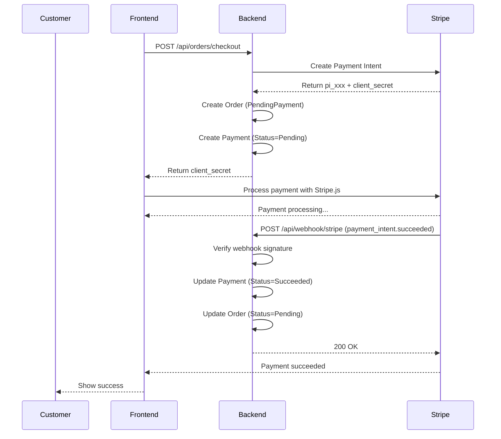

# Stripe Webhook Implementation Guide

## Overview
The webhook controller has been successfully implemented to handle Stripe payment events automatically. This enables your application to receive real-time updates about payment status changes directly from Stripe.

## What Was Implemented

### 1. WebhookController (`AI-Marketplace.Api/Controllers/WebhookController.cs`)
A new controller that handles incoming webhook events from Stripe with the following features:

#### Supported Events:
- **`payment_intent.succeeded`**: Automatically confirms successful payments
  - Updates payment status to `Succeeded`
  - Records the transaction ID (Charge ID)
  - Updates order status from `PendingPayment` to `Pending`
  
- **`payment_intent.payment_failed`**: Handles failed payment attempts
  - Updates payment status to `Failed`
  - Records the failure reason
  - Cancels orders with `PendingPayment` status
  
- **`charge.refunded`**: Tracks refund events
  - Updates refund amount and timestamp
  - Sets status to `Refunded` (full) or `PartiallyRefunded` (partial)

#### Key Features:
? **Webhook Signature Verification**: Validates all incoming requests using Stripe's signature
? **Idempotency**: Safe to process the same event multiple times
? **Comprehensive Logging**: All events and errors are logged for debugging
? **Error Handling**: Graceful handling of malformed or invalid webhooks

### 2. Configuration Updates

#### StripeOptions (`AI-Marketplace.Infrastructure/ExternalServices/payment/StripeOptions.cs`)
- Added `WebhookSecret` property for signature verification

#### appsettings.json
- Added `WebhookSecret` configuration placeholder

## Setup Instructions

### Step 1: Configure Stripe Webhook Secret

1. **Get your webhook secret from Stripe Dashboard:**
   - Go to https://dashboard.stripe.com/webhooks
   - Click "Add endpoint"
   - Enter your webhook URL: `https://yourdomain.com/api/webhook/stripe`
   - Select events to listen to:
     - `payment_intent.succeeded`
     - `payment_intent.payment_failed`
     - `charge.refunded`
   - Click "Add endpoint"
   - Copy the **Signing secret** (starts with `whsec_`)

2. **Add the secret to your configuration:**

**appsettings.json:**
```json
{
  "Stripe": {
    "PublishableKey": "pk_test_...",
    "SecretKey": "sk_test_...",
    "WebhookSecret": "whsec_..."
  }
}
```

**appsettings.Development.json** (for local testing):
```json
{
  "Stripe": {
    "PublishableKey": "pk_test_...",
    "SecretKey": "sk_test_...",
    "WebhookSecret": "whsec_..."
  }
}
```

### Step 2: Test Locally with Stripe CLI

For local development, use the Stripe CLI to forward webhooks to your local machine:

1. **Install Stripe CLI:**
   ```bash
   # Windows (using Scoop)
   scoop bucket add stripe https://github.com/stripe/scoop-stripe-cli.git
   scoop install stripe
   
   # Mac (using Homebrew)
   brew install stripe/stripe-cli/stripe
   ```

2. **Login to Stripe:**
   ```bash
   stripe login
   ```

3. **Forward webhooks to your local server:**
   ```bash
   stripe listen --forward-to https://localhost:5001/api/webhook/stripe
   ```
   
   This will output a webhook signing secret like:
   ```
   > Ready! Your webhook signing secret is whsec_xxxxx
   ```
   
   Use this secret in your `appsettings.Development.json`

4. **Test webhook events:**
   ```bash
   # Trigger a test payment success event
   stripe trigger payment_intent.succeeded
   
   # Trigger a test payment failed event
   stripe trigger payment_intent.payment_failed
   
   # Trigger a test refund event
   stripe trigger charge.refunded
   ```

### Step 3: Endpoint Configuration

The webhook endpoint is accessible at:
```
POST /api/webhook/stripe
```

**Important Notes:**
- ?? This endpoint does NOT require authentication (Stripe can't send Bearer tokens)
- ? Security is handled through webhook signature verification
- ? The endpoint is automatically registered when the application starts

## How It Works

### Payment Flow with Webhooks



### Idempotency

The webhook handler is idempotent, meaning it's safe to process the same event multiple times:

```csharp
// Example: If payment is already succeeded, skip processing
if (payment.Status == PaymentStatus.Succeeded)
{
    _logger.LogInformation("Payment already succeeded (idempotent)");
    return;
}
```

This protects against:
- Duplicate webhook deliveries
- Retry attempts by Stripe
- Manual event replays

## Testing

### 1. Test with Stripe Test Cards

Use these test cards in your frontend:

| Card Number | Description |
|-------------|-------------|
| 4242 4242 4242 4242 | Success |
| 4000 0000 0000 0002 | Card declined |
| 4000 0000 0000 9995 | Insufficient funds |

### 2. Monitor Webhook Events

Check your application logs for webhook processing:

```
[Information] Processing Stripe webhook event
[Information] Webhook event type: payment_intent.succeeded, ID: evt_xxx
[Information] Processing payment_intent.succeeded: PaymentIntentId=pi_xxx, Amount=5000
[Information] Payment updated to Succeeded: PaymentId=1, OrderId=123
[Information] Order status updated to Pending: OrderId=123
```

### 3. Verify in Database

After processing a webhook, verify the changes:

```sql
-- Check payment status
SELECT Id, PaymentIntentId, TransactionId, Status, ProcessedAt, CompletedAt
FROM Payments
WHERE PaymentIntentId = 'pi_xxx';

-- Check order status
SELECT Id, BuyerId, Status, TotalAmount
FROM Orders
WHERE Id = 123;
```

## Error Handling

### Common Errors and Solutions

1. **"Missing Stripe signature"**
   - Cause: Webhook request doesn't include `Stripe-Signature` header
   - Solution: Ensure requests are coming from Stripe

2. **"Webhook signature verification failed"**
   - Cause: Incorrect webhook secret in configuration
   - Solution: Double-check your `WebhookSecret` in appsettings.json

3. **"Payment not found for PaymentIntentId"**
   - Cause: Webhook received for a payment not in your database
   - Solution: This is a warning, not an error. Ensure checkout flow creates payments first

4. **"Order already exists for offer (idempotency)"**
   - This is expected behavior, not an error
   - The system prevents duplicate processing

## Security Best Practices

1. ? **Always verify webhook signatures** (implemented)
2. ? **Use HTTPS in production** (required by Stripe)
3. ? **Keep webhook secret secure** (use environment variables or Azure Key Vault)
4. ? **Log all webhook events** (implemented)
5. ? **Implement idempotency** (implemented)
6. ?? **Never expose webhook secret in code or version control**

## Production Deployment Checklist

- [ ] Set up webhook endpoint in Stripe Dashboard (Production)
- [ ] Configure production webhook secret in Azure App Service Configuration
- [ ] Ensure HTTPS is enabled
- [ ] Test webhook with live Stripe account
- [ ] Set up monitoring/alerting for webhook failures
- [ ] Document webhook URL for your team
- [ ] Configure logging level appropriately

## Troubleshooting

### Enable Detailed Logging

In `appsettings.json`:
```json
{
  "Logging": {
    "LogLevel": {
      "Default": "Information",
      "AI_Marketplace.Controllers.WebhookController": "Debug"
    }
  }
}
```

### Test Webhook Manually

Use curl to test the webhook endpoint:

```bash
# This should fail (no valid signature)
curl -X POST https://localhost:5001/api/webhook/stripe \
  -H "Content-Type: application/json" \
  -d '{"type":"payment_intent.succeeded"}'
```

### View Webhook Logs in Stripe Dashboard

1. Go to https://dashboard.stripe.com/webhooks
2. Click on your webhook endpoint
3. View the "Recent events" section
4. Check response codes and error messages

## Integration with Existing Payment Flow

The webhook implementation works alongside your existing payment confirmation endpoint:

### Option 1: Webhook-Only (Recommended)
- Frontend: Just shows success after Stripe confirms
- Backend: Webhook automatically updates payment and order
- Benefits: More reliable, handles edge cases

### Option 2: Hybrid Approach (Current)
- Frontend: Calls `/api/payment/confirm` after payment
- Backend: Webhook also processes the same event
- Benefits: Faster UI feedback, webhook as backup

Both approaches work due to idempotency implementation.

## Next Steps

1. ? Implementation complete
2. [ ] Configure webhook secret in Stripe Dashboard
3. [ ] Test with Stripe CLI locally
4. [ ] Deploy to staging environment
5. [ ] Test end-to-end payment flow
6. [ ] Deploy to production
7. [ ] Monitor webhook events

## Support

If you encounter issues:
1. Check application logs for detailed error messages
2. Review Stripe webhook logs in dashboard
3. Verify webhook secret configuration
4. Test with Stripe CLI for debugging

---

**Implementation Date:** 2024
**Status:** ? Complete and Ready for Testing
